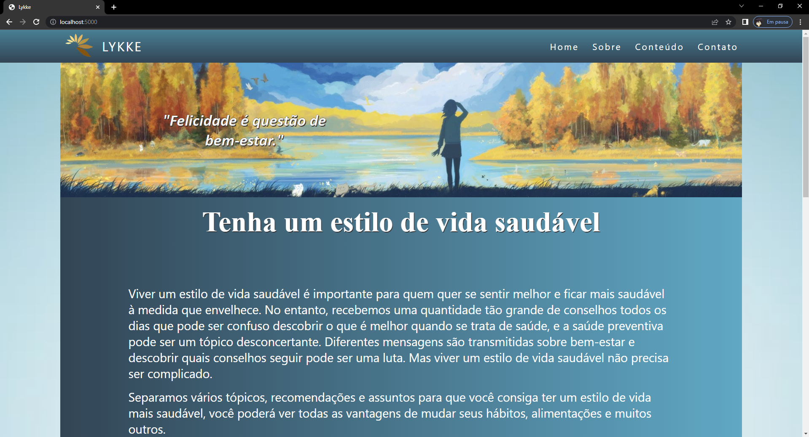
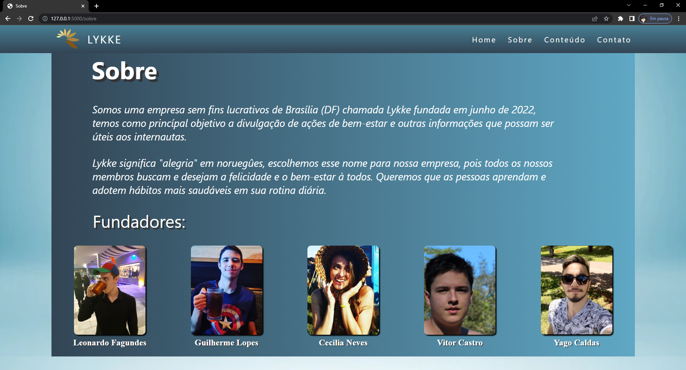
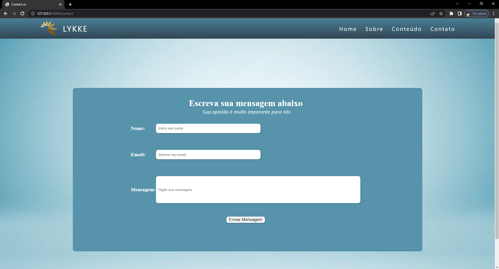
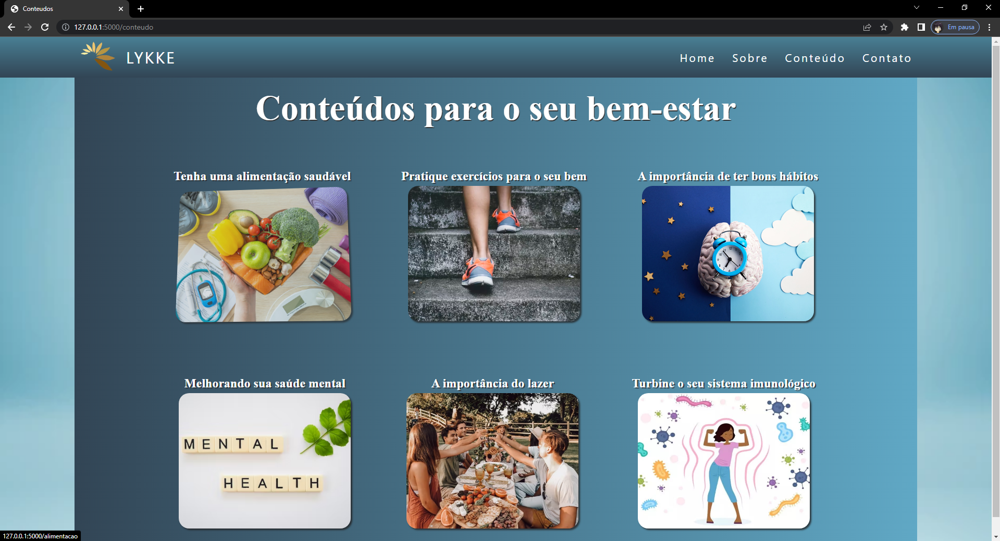
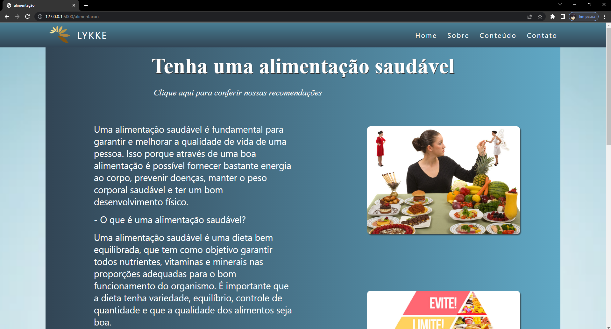
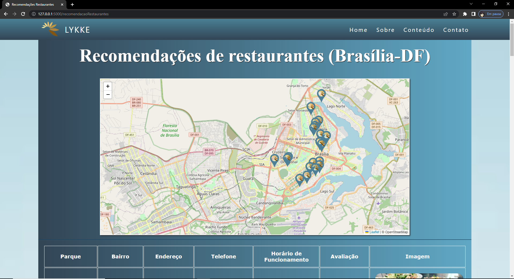

# LYKKE
## Aplicação web - divulgações de bem-estar

Olá ^^, essa é uma aplicação web que fiz em grupo para o terceiro semestre da minha faculdade.
Utilizei apenas Python (Flask), HTML, CSS, SQL e JavaScript, é um site com objetivo de divulgar ações de bem-estar como "Tenha uma boa alimentação", "Faça exercícios" e entre outros.

Disponibilizei o arquivo em SQL, para iniciar o código basta rodar o banco de dados em algum SQL interpreter (utilizei o MySQL Workbench),
dentro do main.py tem um campo para você colocar o usuario, a senha e o esquema do seu SQL,
em seguida rode o arquivo Python (main.py), vá para o seu navegador e digite: "localhost:5000/". 
Agora já é póssível navegar pelo site.

Escolhemos o tema monocromático azul claro como na imagem abaixo:
  

    

 
Clicando em "Sobre" iremos para uma página que fala um pouco sobre o Lykke e mostra os integrantes(criadores) do projeto.
  

    

 
Clicanddo na parte de "Contato" vamos para uma página onde a pessoa irá informar seu nome, o email e uma mensagem que será redirecionada para o banco de dados. (A data em que a pessoa mandou vai ficar salva auitomaticamente lá também).
  

    

 
Clicando na parte de "Conteúdo" vamos para a página que contém os conteúdos do nosso site.
  

    

 
Cada conteúdo é tem sua matéria, seus gráficos e uma opção em que podemos conferir algumas recomendações relacionadas ao conteúdo em específico. Por exemplo vamos clicar em alimentação saudável.
  

    

 
e em seguida clicar em "Clique aqui para conferir nossas recomendações"
  

    

 
Abre uma página com um mapa e suas informações sobre restaurantes saudáveis que tem perto de onde eu moro, todas as longitudes, latitudes, nomes, endereços e entre outros, foi pego diretamente do banco de dados.

  
Foi uma experiência bem bacana, aprendi bastante durante o projeto. 
